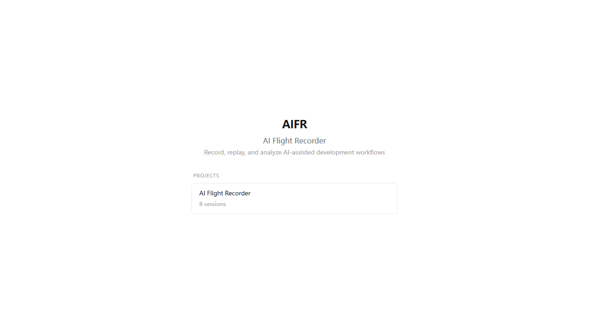
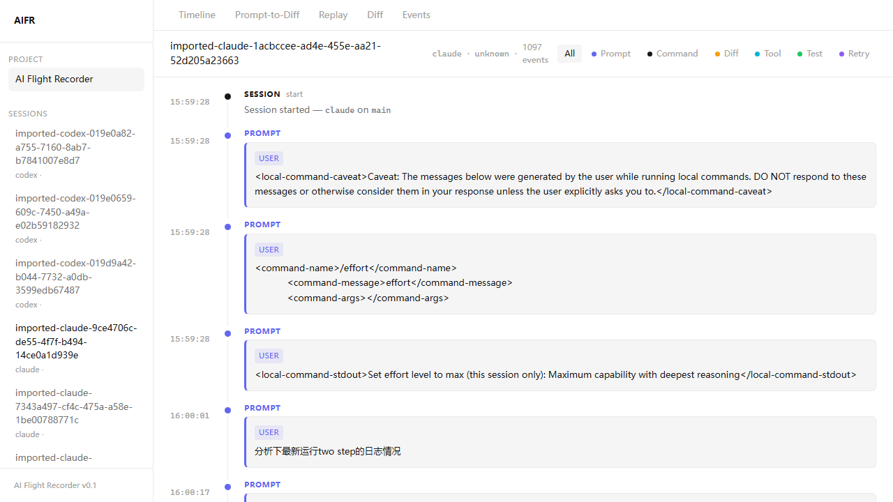
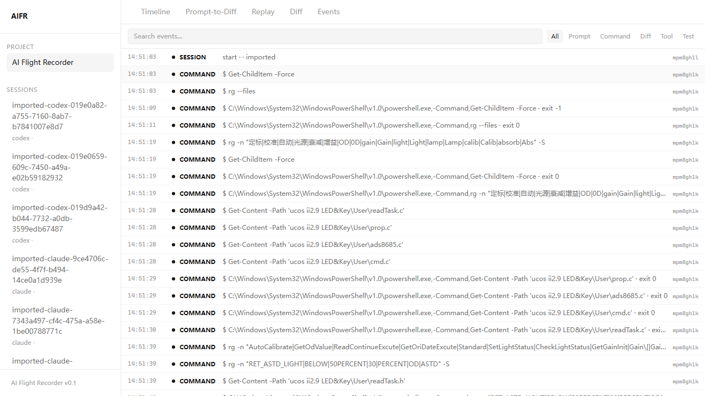
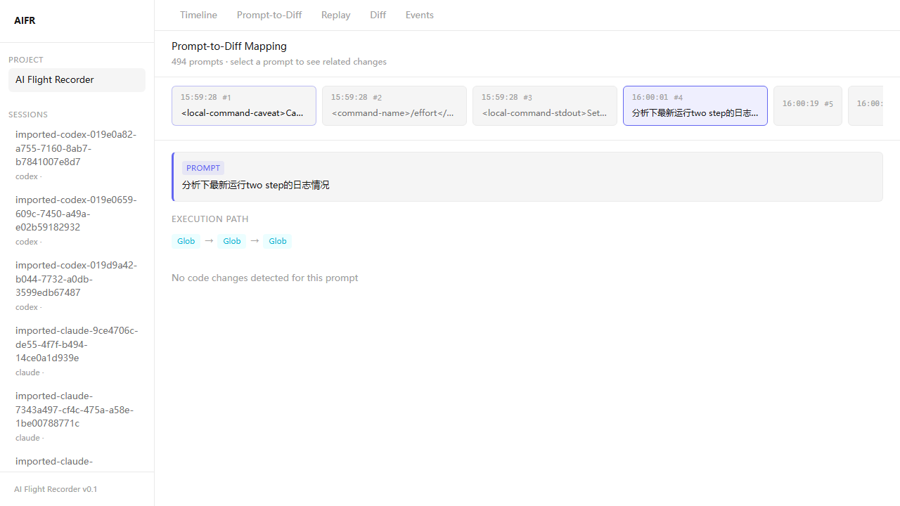
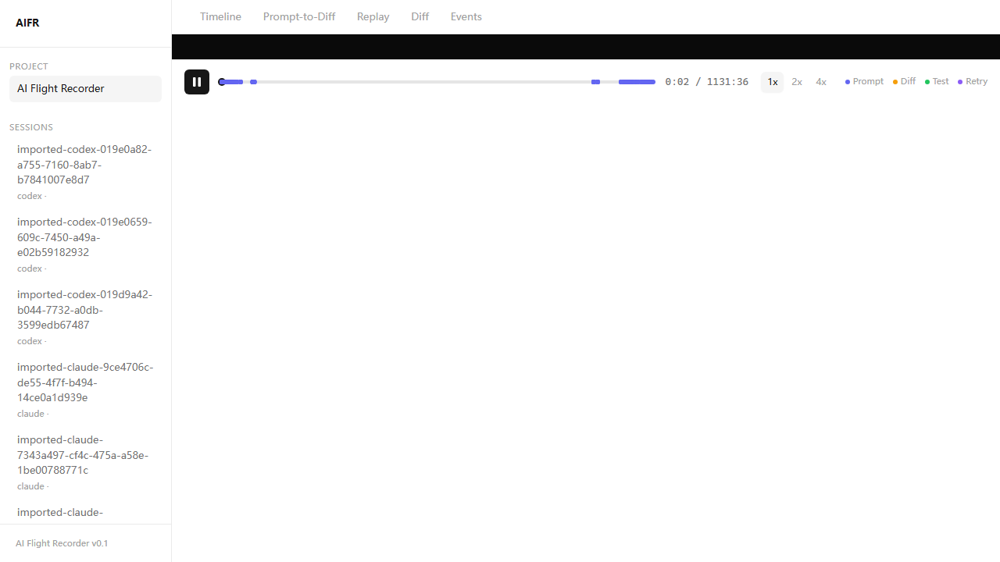
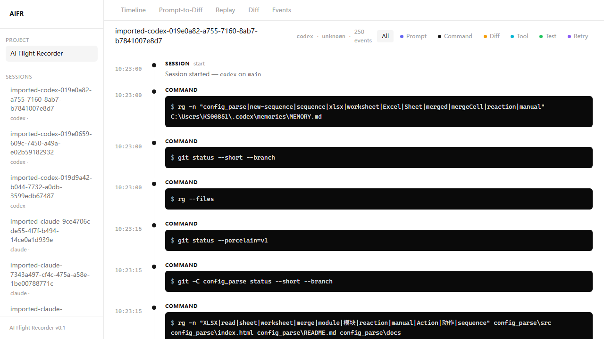

# AIFR — AI Flight Recorder

> AI 软件开发的可观测性平台

记录、回放、分析 AI 辅助编程的全过程。不只是聊天记录，而是结构化的执行图谱。

AIFR 捕获 AI 编程会话中的每一个 Prompt、终端命令、代码变更、测试结果和重试操作，生成可回放、可审计的时间线。

## 截图

| 首页 | 时间线 |
|------|--------|
|  |  |

| 事件详情 | Prompt-to-Diff |
|----------|----------------|
|  |  |

| 终端回放 | Codex 支持 |
|----------|-----------|
|  |  |

## 安装

<a href="https://github.com/GeziP/AI-Flight-Recorder/releases/download/v0.1.2/aifr-0.1.2.tgz"></a>

```bash
npm i -g https://github.com/GeziP/AI-Flight-Recorder/releases/download/v0.1.2/aifr-0.1.2.tgz
```

安装完成后即可直接使用 `aifr` 命令。

## 快速开始

### 1. 初始化

```bash
cd your-project
aifr init
```

在项目中创建 `.aifr/` 目录，所有会话数据存储在本地。

### 2. 导入已有会话

如果你已经在用 Claude Code 或 Codex CLI，可以直接导入历史会话：

```bash
aifr import claude          # 导入全部 Claude Code 会话
aifr import codex           # 导入全部 Codex CLI 会话
aifr import codex --limit 5 # 只导入最近 5 个
```

### 3. 录制新会话

```bash
aifr start
```

启动终端录制器，正常使用 AI 编程工具即可。在终端中输入 `exit` 或按 `Ctrl+D` 结束录制，会话数据会自动保存。

> **注意**：`aifr start` 需要在真实的终端环境中运行，通过管道（如 `echo exit | aifr start`）会导致 stdin 不可用。

### 4. 查看会话状态

```bash
aifr status
```

列出所有已录制的会话。

### 5. 启动 Web UI

```bash
aifr ui
# 自动打开浏览器 http://localhost:3000
```

或者使用 `--no-open` 不自动打开浏览器：

```bash
aifr ui --no-open
```

Web UI 提供以下视图：

| 视图 | 说明 |
|------|------|
| **首页** | 列出所有已扫描的项目及其会话数 |
| **项目页面** | 列出该项目下的所有会话 |
| **时间线** | 按时间顺序展示所有事件 — Prompt、命令、Diff、测试、重试 |
| **Prompt-to-Diff** | 每个 AI 指令对应的代码变更路径 |
| **Diff** | 文件变更的并排对比视图 |
| **回放** | 终端录像回放，支持播放/暂停/变速 |
| **事件** | 原始事件浏览器，支持搜索、类型过滤、JSON 详情 |

## 命令一览

全局安装后（`npm i -g aifr`）可直接使用 `aifr` 命令：

```bash
aifr init              # 在当前项目初始化 AIFR
aifr start             # 启动终端录制，开始新会话
aifr status            # 查看已录制的会话列表
aifr import claude     # 导入 Claude Code 历史会话
aifr import codex      # 导入 Codex CLI 历史会话
aifr ui                # 启动 Web UI (默认自动打开浏览器)
aifr ui --no-open      # 启动 Web UI，不自动打开浏览器
aifr ui --port 8080    # 指定端口启动 Web UI
```

## 支持的 AI 工具

| 工具 | 导入历史会话 | 实时录制 |
|------|-------------|---------|
| Claude Code | 支持 | 支持 |
| Codex CLI | 支持 | 支持 |
| Cursor | 计划中 | 计划中 |

## 数据存储

所有数据保存在本地，不会上传到任何服务器。

```
.aifr/sessions/
  20260526_120011/
    events.jsonl          # 结构化事件流
    terminal.log          # 终端原始输出
    metadata.json         # 会话元数据（时间戳、工具类型、Git 引用）
    git/
      before.patch        # 会话开始时的 Git diff
      after.patch         # 会话结束时的 Git diff
```

## 开发

```bash
pnpm install       # 安装依赖
pnpm build:cli     # 构建 CLI 和核心包
pnpm dev:web       # 启动 Web UI 开发服务器
pnpm aifr <cmd>    # 开发模式运行 CLI
```

发布新版本：

```bash
pnpm publish:dry   # 打包 tarball，检查内容
pnpm publish:release  # 发布到 npm（需登录）
```

也可通过 GitHub Releases 发布：

```bash
gh release create v0.1.3 aifr-0.1.3.tgz --title "v0.1.3" --generate-notes
```

## 已知限制

- 导入的会话没有结构化的 Diff 事件和 Git patch
- Codex 会话包含命令但没有用户 Prompt
- 终端回放基于输出内容而非精确时间戳
- Prompt-to-Diff 映射是推断的，不保证准确
- `aifr start` 需要在真实终端中运行，管道 stdin 不支持 raw mode

详见 [docs/known-limitations.md](docs/known-limitations.md)。

## 许可证

MIT
