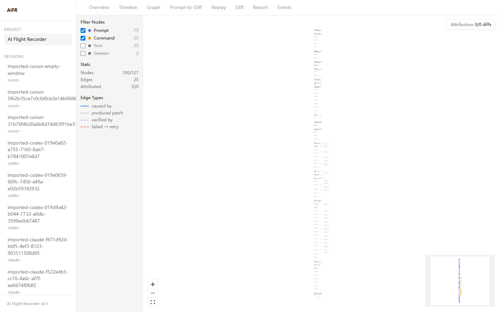
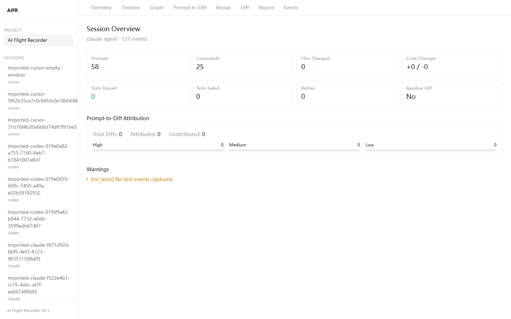

# AIFR — AI Flight Recorder

> OpenTelemetry for AI Software Development

Record, replay, and analyze AI-assisted coding sessions. Not chat transcripts — structured execution graphs.

AIFR captures every prompt, terminal command, code diff, test result, and retry in an AI coding session, producing a replayable, auditable event stream.

## Screenshots

| Home | Timeline |
|------|----------|
|  |  |

| Prompt-to-Diff | Execution Graph |
|-----------------|-----------------|
|  |  |

| Session Overview | Terminal Replay |
|------------------|-----------------|
|  |  |

## Install

<a href="https://github.com/GeziP/AI-Flight-Recorder/releases/download/v0.2.0/aifr-0.2.0.tgz"></a>

```bash
npm i -g https://github.com/GeziP/AI-Flight-Recorder/releases/download/v0.2.0/aifr-0.2.0.tgz
```

## Quick Start

### 1. Import existing sessions

If you already use Claude Code, Codex CLI, or Cursor, import history in one command:

```bash
cd your-project
aifr init
aifr import claude          # Import all Claude Code sessions
aifr import codex           # Import all Codex CLI sessions
aifr import cursor          # Import all Cursor AI sessions
aifr import claude --limit 5
```

### 2. Launch Web UI

```bash
aifr ui
# Opens http://localhost:3000
```

The Web UI provides these views:

| View | Description |
|------|-------------|
| **Timeline** | Chronological event stream with search and filters |
| **Graph** | Execution graph with Dagre layout and node detail panel |
| **Prompt-to-Diff** | Which AI prompt caused which code change |
| **Overview** | Session metrics: attribution rate, retries, test results |
| **Diff** | Side-by-side code diff for session-scoped changes |
| **Replay** | Terminal playback with speed control and event markers |
| **Report** | Generated markdown session summary |

### 3. Search across sessions

```bash
aifr search "authentication"
aifr search "failed" --type test
aifr search "src/auth" --type diff
```

Full-text search powered by SQLite FTS5, across all events in all sessions.

### 4. Other commands

```bash
aifr status                # List all sessions
aifr diff [session]        # View code changes in a session
aifr replay [session]      # Replay terminal output
aifr report [session]      # Generate markdown report
aifr redact [session]      # Strip secrets from events
aifr export [session]      # Export as .aifz archive
```

## Supported AI Tools

| Tool | Import | Live Recording |
|------|--------|----------------|
| Claude Code | Yes | Yes |
| Codex CLI | Yes | Yes |
| Cursor | Yes | Planned |

## Command Reference

```
aifr init                Initialize .aifr/ in current project
aifr start               Start terminal recording
aifr status              List recorded sessions
aifr import <agent>      Import sessions (claude, codex, cursor)
aifr search <query>      Full-text search across sessions
aifr graph [session]     Build execution graph
aifr analyze [session]   Run session analysis
aifr report [session]    Generate markdown report
aifr redact [session]    Redact secrets from events
aifr replay [session]    Replay terminal output
aifr diff [session]      View code changes
aifr export [session]    Export as portable archive
aifr ui                  Launch Web UI
```

## Data Storage

All data stays local. Nothing is uploaded.

```
.aifr/sessions/
  20260526_120011/
    events.jsonl          # Structured event stream (JSONL)
    terminal.log          # Raw terminal output
    metadata.json         # Session metadata (timestamps, agent, git ref)
    graph.json            # Execution graph
    analysis.json         # Session analysis results
    report.md             # Generated report
    git/
      before.patch        # Git diff at session start
      after.patch         # Git diff at session end
```

## Event Schema

All events are normalized to a unified JSONL stream:

- `PromptEvent` — AI request content
- `CommandEvent` — Terminal command execution
- `DiffEvent` — Code changes (file list + patch)
- `ToolEvent` — Tool/API calls
- `TestEvent` — Test results
- `TerminalOutputEvent` — Terminal stdout/stderr
- `RetryEvent` — Retry attempts
- `SessionEvent` — Session lifecycle (start/end)

## Secret Redaction

`aifr redact` scans events for 12 categories of secrets:

AWS keys, GitHub tokens, JWTs, Bearer tokens, API keys, private keys, passwords in URLs, password assignments, email addresses, Slack tokens, Google API keys.

## Development

```bash
pnpm install             # Install dependencies
pnpm build               # Build all packages
pnpm dev:web             # Start Web UI dev server
pnpm test                # Run all tests
```

## Known Limitations

- Imported session git patches reflect project state at import time, not the original session time
- Codex sessions contain commands but no user prompts, and cannot locate the original project directory
- Prompt-to-Diff mapping is inferred (temporal proximity), not provenance-tracked
- `aifr start` requires a real terminal (no pipe stdin)

## License

MIT
