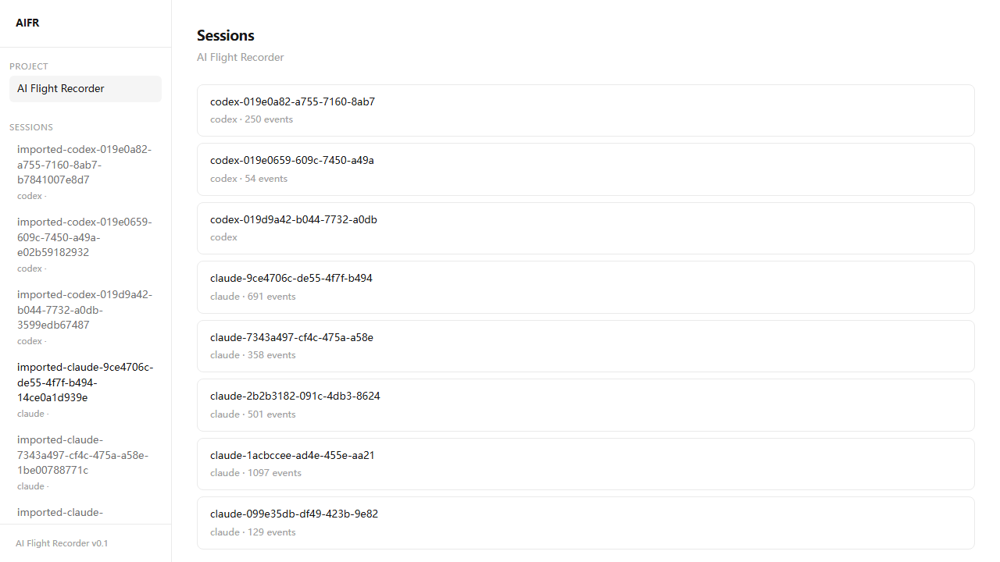

# AIFR — AI Flight Recorder

> OpenTelemetry for AI Software Development

Record, replay, and analyze AI-assisted software development workflows. AIFR captures AI coding sessions as structured event streams — not chat transcripts, but execution graphs.

## What It Does

AIFR records what actually happens when you use AI coding agents:

- **Prompt → Command → Diff → Test → Retry → Final Patch**
- Every terminal command, every file change, every test result — captured as an auditable event stream
- Replay sessions in a web UI with xterm.js terminal playback and diff2html side-by-side diffs
- Import existing Claude Code and Codex CLI sessions
- Map AI prompts to the code changes they produced (Prompt-to-Diff)

## Status

AIFR is in **v0.1** — all core features are implemented and functional:

- Event schema with 8 event types and Zod validation
- CLI: `init`, `start`, `status`, `import claude/codex`
- Parsers for Claude Code (`~/.claude/projects/`) and Codex CLI (`~/.codex/sessions/`)
- Web UI with 5 views: Timeline, Events, Diff, Replay, Prompt-to-Diff
- Terminal recording via node-pty

See [docs/roadmap.md](docs/roadmap.md) for planned features.

## Screenshots

### Homepage


### Session List



### Timeline

Chronological event stream with colored markers for prompts, commands, tools, diffs, tests, and retries.


### Events

Search, filter by type, and inspect raw JSON for any event.


### Replay

Terminal playback with play/pause, speed control (1x/2x/4x), and event markers on the progress bar.


### Prompt-to-Diff

Select a prompt and see its execution path — which tools were called and what files changed.


### Codex CLI Support

Imported Codex CLI sessions display correctly with agent identification and command events.


## Quick Start

```bash
# Install
pnpm install

# Build
pnpm build

# Initialize in a project
pnpm aifr init

# Start recording
pnpm aifr start

# Import existing sessions
pnpm aifr import claude --limit 10
pnpm aifr import codex --limit 10
```

## CLI Commands

| Command | Description |
|---------|-------------|
| `aifr init` | Initialize `.aifr/` in the current project |
| `aifr start` | Start recording a new session (interactive terminal) |
| `aifr status` | List recorded sessions |
| `aifr import claude` | Import Claude Code sessions from `~/.claude/projects/` |
| `aifr import codex` | Import Codex CLI sessions from `~/.codex/sessions/` |

## Web UI

```bash
cd apps/web
pnpm dev
```

Open `http://localhost:3000` to browse projects, sessions, and explore:

- **Timeline** — Chronological view of all events in a session
- **Prompt-to-Diff** — Map AI prompts to the code changes they produced
- **Diff View** — Side-by-side diff visualization with diff2html
- **Replay** — Terminal playback with xterm.js
- **Events** — Raw event browser with search and JSON detail drawer

## Architecture

```
aifr/
├── apps/
│   ├── cli/              # CLI (Node.js + TypeScript, commander.js)
│   └── web/              # Web UI (Next.js, Tailwind, shadcn)
├── packages/
│   ├── event-schema/     # Unified event types + Zod validation
│   ├── core/             # Session lifecycle, JSONL writer, Git capture, PTY recorder
│   ├── parser-claude/    # Parse ~/.claude/projects/ JSONL sessions
│   └── parser-codex/     # Parse ~/.codex/sessions/ JSONL sessions
├── docs/
│   ├── architecture.md
│   ├── session-format.md
│   ├── roadmap.md
│   └── known-limitations.md
└── scripts/
    ├── install.sh        # Unix installer
    └── install.ps1       # Windows installer
```

### Event Schema

8 normalized event types:

`PromptEvent` · `CommandEvent` · `DiffEvent` · `ToolEvent` · `TestEvent` · `SessionEvent` · `TerminalOutputEvent` · `RetryEvent`

All events are append-only JSONL with schema versioning. See [docs/session-format.md](docs/session-format.md).

### Tech Stack

| Layer | Technology |
|-------|-----------|
| CLI | Node.js, TypeScript, commander.js, node-pty |
| Web | Next.js 14, Tailwind CSS, shadcn/ui |
| Replay | xterm.js |
| Diff | diff2html |
| Validation | Zod v4 |
| Git | simple-git |
| Build | tsup, pnpm workspaces |

## Supported AI Agents

| Agent | Import | Live Recording |
|-------|--------|----------------|
| Claude Code | ✅ `~/.claude/projects/` | ✅ via PTY |
| Codex CLI | ✅ `~/.codex/sessions/` | ✅ via PTY |
| Cursor | 🔜 | 🔜 |

## Development

```bash
# Install dependencies
pnpm install

# Build all packages
pnpm build

# Type-check all packages
pnpm typecheck

# Run tests
pnpm test

# Run CLI in dev mode
pnpm aifr <command>

# Start web UI
cd apps/web && pnpm dev
```

## Known Limitations

- Imported sessions have no structured diff events or git patches
- Codex sessions contain commands but no user prompts in the event stream
- Replay playback is based on terminal log output, not structured timing data

See [docs/known-limitations.md](docs/known-limitations.md) for details.

## License

MIT
